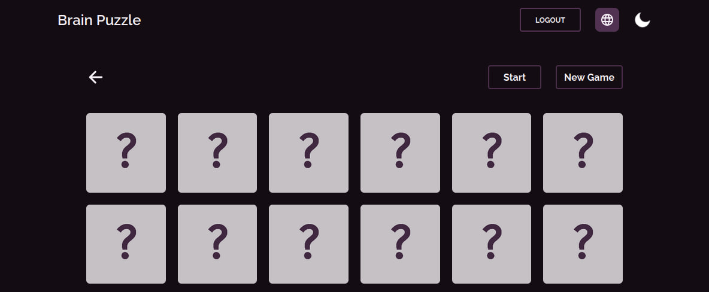

# Brain Puzzle

#### [Read In Kurdish](./READMEKU.md)

## Features

- Built with React and Tailwind CSS for efficient and flexible development of user interfaces.
- Supports both Kurdish and English languages, allowing players to choose their preferred language for gameplay.
- Fully responsive design that adapts to different screen sizes and devices for an optimal user experience.
- Dark and light mode options for a customizable and immersive gaming experience.
- Multiple difficulty levels to challenge players of all skill levels.
